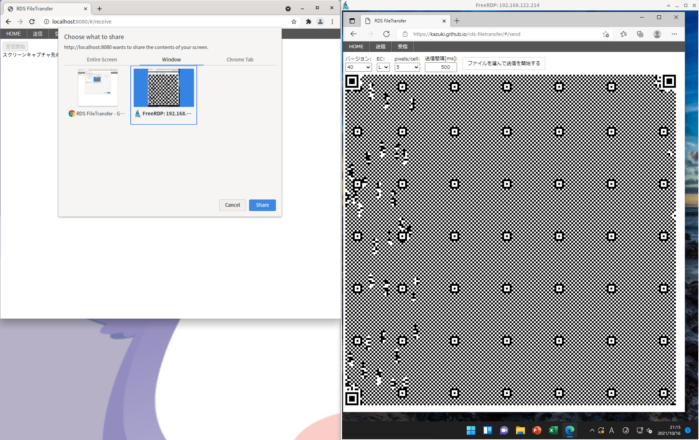
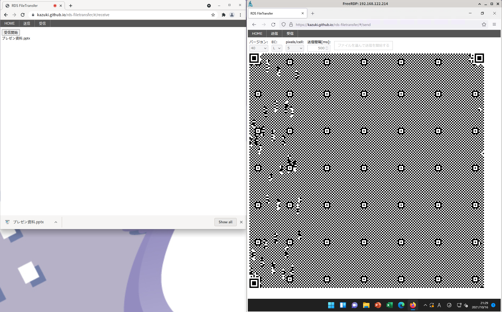

# RDS FileTransfer

RDS等のリモートデスクトップを利用している場合に、
リモートデスクトップ側からローカル側に、
QRコードを利用してファイルを転送するサンプルプログラムです。

https://kazuki.github.io/rds-filetransfer/ から利用することができます。

## 使い方

1. https://kazuki.github.io/rds-filetransfer をRDS側(送信側)とローカル(受信側)でアクセスし、RDS側は送信ページを、ローカル側は受信ページを開きます
2. RDSのウィンドウをQRコードが全部映る範囲で極力小さくします
3. 以下の図のようにローカルで「受信開始」ボタンを押し、RDSのウィンドウを選択します。
4. RDS側で「ファイルを選んで送信を開始する」ボタンを押し、送信したいファイルを選択します。すると以下の図のように転送が始まります。
5. 転送が終わると自動的にローカルに保存されます。

## 注意事項

* DPIスケーリングが有効な場合は送信側設定のセルあたりのピクセル数を大きくしてください
* 受信側で予期しないパニックが発生することがあるので、開発者ツールのコンソールを開いておくことをおすすめします